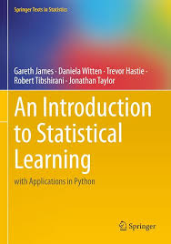

# Statistical Studies
A curated and structured set of course I’ve completed or am currently following, covering fundamental concepts, methods, and applications related to the world of Statistics.

## Table of Content
1. [Statistical Learning with Python](#statistical-learning-with-python) 🔄

---

### [Statistical Learning with Python](https://www.edx.org/learn/python/stanford-university-statistical-learning-with-python)
The course explores the fundamental concepts of statistical modeling and machine learning, with a strong focus on applications in Python.
This course is ideal for students and professionals with a background in basic statistics and programming. 
It emphasizes both theoretical understanding and practical implementation of statistical learning methods.

#### Chapter 1: Introduction ✅
- [x] 1.1 Opening Remarks
- [x] 1.2 Examples and Framework

#### Chapter 2: Overview of Statistical Learning ✅
- [x] 2.1 Introduction to Regression Models
- [x] 2.2 Dimensionality and Structured Models
- [x] 2.3 Model Selection and Bias-Variance Tradeoff
- [x] 2.4 Classification
- [x] 2.Py Introduction to Python

#### Chapter 3: Linear Regression ✅
- [x] 3.1 Simple Linear Regression
- [x] 3.2 Hypothesis Testing and Confidence Intervals
- [x] 3.3 Multiple Linear Regression
- [x] 3.4 Some Important Questions
- [x] 3.5 Extensions of the Linear Model
- [x] 3.Py Linear Regression in Python

#### Chapter 4: Classification ✅
- [x] 4.1 Introduction to Classification Problems
- [x] 4.2 Logistic Regression
- [x] 4.3 Multivariate Logistic Regression
- [x] 4.4 Case-Control Sampling and Multiclass
- [x] 4.5 Discriminant Analysis
- [x] 4.6 GDA - One Variable
- [x] 4.7 GDA - Many Variables
- [x] 4.8 Generalized Linear Models
- [x] 4.9 QDA and Naive Bayes
- [x] 4.Py Logistic Regression, LDA, QDA, and KNN

#### Chapter 5: Resampling Methods
- [ ] 5.1 Cross-validation
- [ ] 5.2 K-fold Cross-Validation
- [ ] 5.3 CV: Right and Wrong Way
- [ ] 5.4 The Bootstrap
- [ ] 5.5 More on the Bootstrap
- [ ] 5.Py Cross-Validation and the Bootstrap

#### Chapter 6: Linear Model Selection and Regularization
- [ ] 6.1 Best-Subset Selection
- [ ] 6.2 Stepwise Selection
- [ ] 6.3 Backward Stepwise
- [ ] 6.4 Estimating Test Error
- [ ] 6.5 Validation and CV
- [ ] 6.6 Shrinkage and Ridge
- [ ] 6.7 The Lasso
- [ ] 6.8 Tuning Parameters
- [ ] 6.9 Dimension Reduction
- [ ] 6.10 PCR and PLS
- [ ] 6.Py Regularization Methods

#### Chapter 7: Moving Beyond Linearity
- [ ] 7.1 Polynomials and Step Functions
- [ ] 7.2 Splines
- [ ] 7.3 Smoothing Splines
- [ ] 7.4 GAMs and Local Regression
- [ ] 7.Py Nonlinear Modeling

#### Chapter 8: Tree-Based Methods
- [ ] 8.1 Tree-Based Methods
- [ ] 8.2 More on Trees
- [ ] 8.3 Classification Trees
- [ ] 8.4 Bagging and Random Forests
- [ ] 8.5 Boosting
- [ ] 8.6 BART
- [ ] 8.Py Tree-Based Methods

#### Chapter 9: Support Vector Machines
- [ ] 9.1 Optimal Hyperplanes
- [ ] 9.2 Support Vector Classifier
- [ ] 9.3 Feature Expansion and SVM
- [ ] 9.4 Logistic Regression Comparison
- [ ] 9.Py SVMs in Python

#### Chapter 10: Deep Learning
- [ ] 10.1 Neural Networks
- [ ] 10.2 CNNs
- [ ] 10.3 Document Classification
- [ ] 10.4 RNNs
- [ ] 10.5 Time-Series Forecasting
- [ ] 10.6 Fitting NNs
- [ ] 10.7 Interpolation and Double Descent
- [ ] 10.Py Deep Learning

#### Chapter 11: Survival Analysis and Censored Data
- [ ] 11.1 Introduction to Survival Data
- [ ] 11.2 Proportional Hazards Model
- [ ] 11.3 Cox Model Estimation
- [ ] 11.4 Model Evaluation
- [ ] 11.Py Survival Analysis

#### Chapter 12: Unsupervised Learning
- [ ] 12.1 Principal Components
- [ ] 12.2 Higher-Order PCs
- [ ] 12.3 k-means Clustering
- [ ] 12.4 Hierarchical Clustering
- [ ] 12.5 Matrix Completion
- [ ] 12.6 Breast Cancer Example
- [ ] 12.Py Unsupervised Learning

#### Chapter 13: Multiple Testing
- [ ] 13.1 Intro to Hypothesis Testing
- [ ] 13.2 Multiple Testing and FWER
- [ ] 13.3 Bonferroni Method
- [ ] 13.4 Holm's Method
- [ ] 13.5 FDR and Benjamini-Hochberg
- [ ] 13.6 Resampling Approaches

