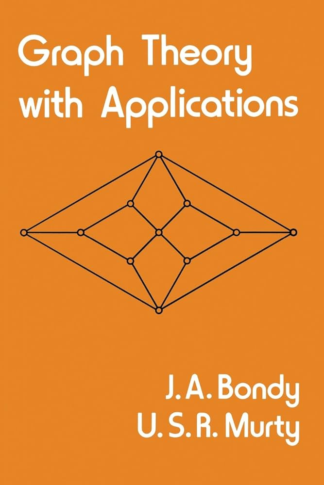

# Graph Theory with applications (Bondy & Murty, *GTWA*)
*Graph Theory with Applications by Bondy and Murty provides a systematic introduction to finite graph theory, combining rigorous theory with concrete, real-world applications. The book develops the structural foundations of graphs—connectivity, trees, cycles, matchings, colourings, planarity, flows, and directed graphs—while emphasizing proof techniques, extremal reasoning, and algorithmic ideas. Throughout, abstract results are consistently motivated and illustrated by classical optimization and network problems (such as shortest paths, matchings, flows, and routing), making the text both a theoretical reference and a bridge to applied graph theory.*

---

## 1. Graphs and Subgraphs
- [x] 1.1 Graphs and Simple Graphs
- [x] 1.2 Graph Isomorphism
- [x] 1.3 The Incidence and Adjacency Matrices
- [x] 1.4 Subgraphs
- [x] 1.5 Vertex Degrees
- [x] 1.6 Paths and Connection
- [x] 1.7 Cycles
- [x] 1.8 The Shortest Path Problem
- [x] 1.9 Sperner’s Lemma

## 2. Trees
- [x] 2.1 Trees
- [x] 2.2 Cut Edges and Bonds
- [x] 2.3 Cut Vertices
- [x] 2.4 Cayley’s Formula
- [x] 2.5 The Connector Problem

## 3. Connectivity
- [x] 3.1 Connectivity
- [x] 3.2 Blocks
- [x] 3.3 Construction of Reliable Communication Networks

## 4. Euler Tours and Hamilton Cycles
- [x] 4.1 Euler Tours
- [x] 4.2 Hamilton Cycles
- [x] 4.3 The Chinese Postman Problem
- [x] 4.4 The Travelling Salesman Problem

## 5. Matchings
- [] 5.1 Matchings
- [] 5.2 Matchings and Coverings in Bipartite Graphs
- [] 5.3 Perfect Matchings
- [] 5.4 The Personnel Assignment Problem
- [] 5.5 The Optimal Assignment Problem

## 6. Edge Colourings
- [] 6.1 Edge Chromatic Number
- [] 6.2 Vizing’s Theorem
- [] 6.3 The Timetabling Problem

## 7. Independent Sets and Cliques
- [] 7.1 Independent Sets
- [] 7.2 Ramsey’s Theorem
- [] 7.3 Turán’s Theorem
- [] 7.4 Schur’s Theorem
- [] 7.5 A Geometry Problem

## 8. Vertex Colourings
- [] 8.1 Chromatic Number
- [] 8.2 Brooks’ Theorem
- [] 8.3 Hajós’ Conjecture
- [] 8.4 Chromatic Polynomials
- [] 8.5 Girth and Chromatic Number
- [] 8.6 A Storage Problem

## 9. Planar Graphs
- [] 9.1 Plane and Planar Graphs
- [] 9.2 Dual Graphs
- [] 9.3 Euler’s Formula
- [] 9.4 Bridges
- [] 9.5 Kuratowski’s Theorem
- [] 9.6 The Five-Colour Theorem and the Four-Colour Conjecture
- [] 9.7 Nonhamiltonian Planar Graphs
- [] 9.8 A Planarity Algorithm

## 10. Directed Graphs
- [] 10.1 Directed Graphs
- [] 10.2 Directed Paths
- [] 10.3 Directed Cycles
- [] 10.4 A Job Sequencing Problem
- [] 10.5 Designing an Efficient Computer Drum
- [] 10.6 Making a Road System One-Way
- [] 10.7 Ranking the Participants in a Tournament

## 11. Networks
- [] 11.1 Flows
- [] 11.2 Cuts
- [] 11.3 The Max-Flow Min-Cut Theorem
- [] 11.4 Menger’s Theorems
- [] 11.5 Feasible Flows

## 12. The Cycle Space and Bond Space
- [] 12.1 Circulations and Potential Differences
- [] 12.2 The Number of Spanning Trees
- [] 12.3 Perfect Squares

## Appendices
- [] Appendix I – Hints to Starred Exercises
- [] Appendix II – Four Graphs and a Table of Their Properties
- [] Appendix III – Some Interesting Graphs
- [] Appendix IV – Unsolved Problems

