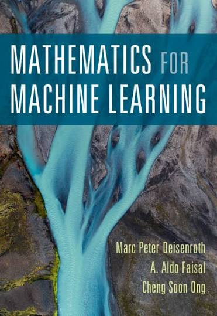

# Deisenroth, Faisal & Ong, *Mathematics for Machine Learning*

[⬅ Back to tracker](README.md)

## 📑 Table of Contents

**Part I — Mathematical Foundations**

1. [Introduction and Motivation](#ch1)
2. [Linear Algebra](#ch2)
3. [Analytic Geometry](#ch3)
4. [Matrix Decompositions](#ch4)
5. [Vector Calculus](#ch5)
6. [Probability and Distributions](#ch6)
7. [Continuous Optimization](#ch7)

**Part II — Central Machine Learning Problems**

8. [When Models Meet Data](#ch8)
9. [Linear Regression](#ch9)
10. [Dimensionality Reduction with Principal Component Analysis](#ch10)
11. [Density Estimation with Gaussian Mixture Models](#ch11)
12. [Classification with Support Vector Machines](#ch12)

## Part I — Mathematical Foundations

### Ch. 1 — Introduction and Motivation (p. 11)
- [ ] 1.1 Finding Words for Intuitions (p. 12)
- [ ] 1.2 Two Ways to Read This Book (p. 13)
- [ ] 1.3 Exercises and Feedback (p. 16)

[⬆ Back to top](#top)

### Ch. 2 — Linear Algebra (p. 17)
- [ ] 2.1 Systems of Linear Equations (p. 19)
- [ ] 2.2 Matrices (p. 22)
- [ ] 2.3 Solving Systems of Linear Equations (p. 27)
- [ ] 2.4 Vector Spaces (p. 35)
- [ ] 2.5 Linear Independence (p. 40)
- [ ] 2.6 Basis and Rank (p. 44)
- [ ] 2.7 Linear Mappings (p. 48)
- [ ] 2.8 Affine Spaces (p. 61)
- [ ] 2.9 Further Reading (p. 63)
- [ ] Exercises (p. 64)

[⬆ Back to top](#top)

### Ch. 3 — Analytic Geometry (p. 70)
- [ ] 3.1 Norms (p. 71)
- [ ] 3.2 Inner Products (p. 72)
- [ ] 3.3 Lengths and Distances (p. 75)
- [ ] 3.4 Angles and Orthogonality (p. 76)
- [ ] 3.5 Orthonormal Basis (p. 78)
- [ ] 3.6 Orthogonal Complement (p. 79)
- [ ] 3.7 Inner Product of Functions (p. 80)
- [ ] 3.8 Orthogonal Projections (p. 81)
- [ ] 3.9 Rotations (p. 91)
- [ ] 3.10 Further Reading (p. 94)
- [ ] Exercises (p. 96)

[⬆ Back to top](#top)

### Ch. 4 — Matrix Decompositions (p. 98)
- [ ] 4.1 Determinant and Trace (p. 99)
- [ ] 4.2 Eigenvalues and Eigenvectors (p. 105)
- [ ] 4.3 Cholesky Decomposition (p. 114)
- [ ] 4.4 Eigendecomposition and Diagonalization (p. 115)
- [ ] 4.5 Singular Value Decomposition (p. 119)
- [ ] 4.6 Matrix Approximation (p. 129)
- [ ] 4.7 Matrix Phylogeny (p. 134)
- [ ] 4.8 Further Reading (p. 135)
- [ ] Exercises (p. 137)

[⬆ Back to top](#top)

### Ch. 5 — Vector Calculus (p. 139)
- [ ] 5.1 Differentiation of Univariate Functions (p. 141)
- [ ] 5.2 Partial Differentiation and Gradients (p. 146)
- [ ] 5.3 Gradients of Vector-Valued Functions (p. 149)
- [ ] 5.4 Gradients of Matrices (p. 155)
- [ ] 5.5 Useful Identities for Computing Gradients (p. 158)
- [ ] 5.6 Backpropagation and Automatic Differentiation (p. 159)
- [ ] 5.7 Higher-Order Derivatives (p. 164)
- [ ] 5.8 Linearization and Multivariate Taylor Series (p. 165)
- [ ] 5.9 Further Reading (p. 170)
- [ ] Exercises (p. 170)

[⬆ Back to top](#top)

### Ch. 6 — Probability and Distributions (p. 172)
- [ ] 6.1 Construction of a Probability Space (p. 172)
- [ ] 6.2 Discrete and Continuous Probabilities (p. 178)
- [ ] 6.3 Sum Rule, Product Rule, and Bayes' Theorem (p. 183)
- [ ] 6.4 Summary Statistics and Independence (p. 186)
- [ ] 6.5 Gaussian Distribution (p. 197)
- [ ] 6.6 Conjugacy and the Exponential Family (p. 205)
- [ ] 6.7 Change of Variables / Inverse Transform (p. 214)
- [ ] 6.8 Further Reading (p. 221)
- [ ] Exercises (p. 222)

[⬆ Back to top](#top)

### Ch. 7 — Continuous Optimization (p. 225)
- [ ] 7.1 Optimization Using Gradient Descent (p. 227)
- [ ] 7.2 Constrained Optimization and Lagrange Multipliers (p. 233)
- [ ] 7.3 Convex Optimization (p. 236)
- [ ] 7.4 Further Reading (p. 246)
- [ ] Exercises (p. 247)

[⬆ Back to top](#top)

## Part II — Central Machine Learning Problems

### Ch. 8 — When Models Meet Data (p. 251)
- [ ] 8.1 Data, Models, and Learning (p. 251)
- [ ] 8.2 Empirical Risk Minimization (p. 258)
- [ ] 8.3 Parameter Estimation (p. 265)
- [ ] 8.4 Probabilistic Modeling and Inference (p. 272)
- [ ] 8.5 Directed Graphical Models (p. 278)
- [ ] 8.6 Model Selection (p. 283)

[⬆ Back to top](#top)

### Ch. 9 — Linear Regression (p. 289)
- [ ] 9.1 Problem Formulation (p. 291)
- [ ] 9.2 Parameter Estimation (p. 292)
- [ ] 9.3 Bayesian Linear Regression (p. 303)
- [ ] 9.4 Maximum Likelihood as Orthogonal Projection (p. 313)
- [ ] 9.5 Further Reading (p. 315)

[⬆ Back to top](#top)

### Ch. 10 — Dimensionality Reduction with Principal Component Analysis (p. 317)
- [ ] 10.1 Problem Setting (p. 318)
- [ ] 10.2 Maximum Variance Perspective (p. 320)
- [ ] 10.3 Projection Perspective (p. 325)
- [ ] 10.4 Eigenvector Computation and Low-Rank Approximations (p. 333)
- [ ] 10.5 PCA in High Dimensions (p. 335)
- [ ] 10.6 Key Steps of PCA in Practice (p. 336)
- [ ] 10.7 Latent Variable Perspective (p. 339)
- [ ] 10.8 Further Reading (p. 343)

[⬆ Back to top](#top)

### Ch. 11 — Density Estimation with Gaussian Mixture Models (p. 348)
- [ ] 11.1 Gaussian Mixture Model (p. 349)
- [ ] 11.2 Parameter Learning via Maximum Likelihood (p. 350)
- [ ] 11.3 EM Algorithm (p. 360)
- [ ] 11.4 Latent-Variable Perspective (p. 363)
- [ ] 11.5 Further Reading (p. 368)

[⬆ Back to top](#top)

### Ch. 12 — Classification with Support Vector Machines (p. 370)
- [ ] 12.1 Separating Hyperplanes (p. 372)
- [ ] 12.2 Primal Support Vector Machine (p. 374)
- [ ] 12.3 Dual Support Vector Machine (p. 383)
- [ ] 12.4 Kernels (p. 388)
- [ ] 12.5 Numerical Solution (p. 390)
- [ ] 12.6 Further Reading (p. 392)

[⬆ Back to top](#top)
