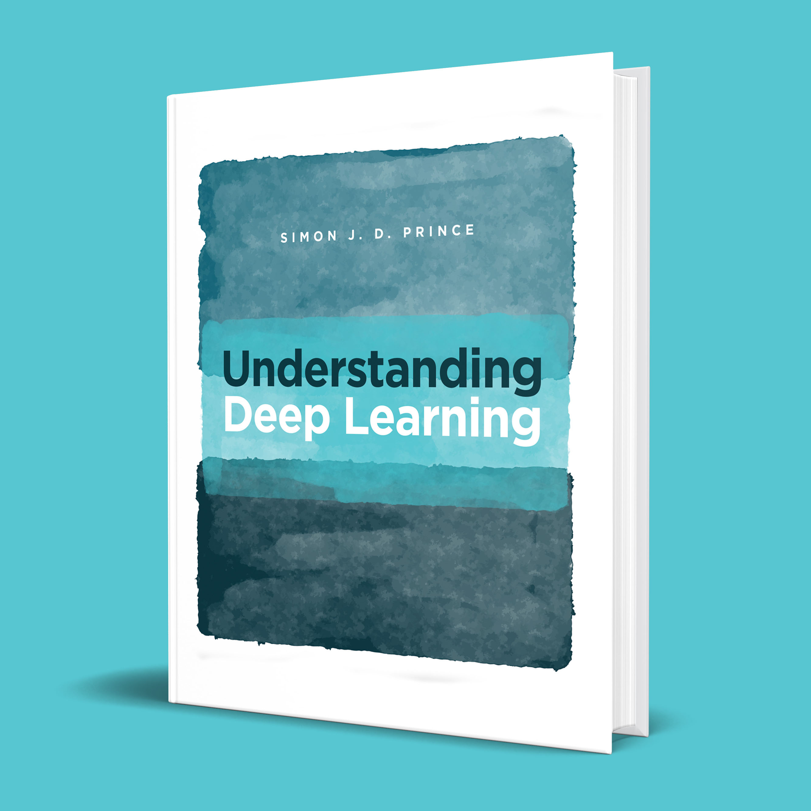

# Prince, *Understanding Deep Learning*

[⬅ Back to tracker](README.md)

## 📑 Table of Contents

**Chapters**

1. [Introduction](#ch1)
2. [Supervised Learning](#ch2)
3. [Shallow Neural Networks](#ch3)
4. [Deep Neural Networks](#ch4)
5. [Loss Functions](#ch5)
6. [Fitting Models](#ch6)
7. [Gradients and Initialization](#ch7)
8. [Measuring Performance](#ch8)
9. [Regularization](#ch9)
10. [Convolutional Networks](#ch10)
11. [Residual Networks](#ch11)
12. [Transformers](#ch12)
13. [Graph Neural Networks](#ch13)
14. [Unsupervised Learning](#ch14)
15. [Generative Adversarial Networks](#ch15)
16. [Normalizing Flows](#ch16)
17. [Variational Autoencoders](#ch17)
18. [Diffusion Models](#ch18)
19. [Reinforcement Learning](#ch19)
20. [Why Does Deep Learning Work?](#ch20)
21. [Deep Learning and Ethics](#ch21)

**Appendices**

- [A. Notation](#appA)
- [B. Mathematics](#appB)
- [C. Probability](#appC)

## Chapters

### Ch. 1 — Introduction (p. 1)
- [ ] 1.1 Supervised learning (p. 1)
- [ ] 1.2 Unsupervised learning (p. 7)
- [ ] 1.3 Reinforcement learning (p. 11)
- [ ] 1.4 Ethics (p. 12)
- [ ] 1.5 Structure of book (p. 15)
- [ ] 1.6 Other books (p. 15)
- [ ] 1.7 How to read this book (p. 16)

[⬆ Back to top](#top)

### Ch. 2 — Supervised Learning (p. 17)
- [ ] 2.1 Supervised learning overview (p. 17)
- [ ] 2.2 Linear regression example (p. 18)
- [ ] 2.3 Summary (p. 22)

[⬆ Back to top](#top)

### Ch. 3 — Shallow Neural Networks (p. 25)
- [ ] 3.1 Neural network example (p. 25)
- [ ] 3.2 Universal approximation theorem (p. 29)
- [ ] 3.3 Multivariate inputs and outputs (p. 30)
- [ ] 3.4 Shallow neural networks: general case (p. 33)
- [ ] 3.5 Terminology (p. 35)
- [ ] 3.6 Summary (p. 36)

[⬆ Back to top](#top)

### Ch. 4 — Deep Neural Networks (p. 41)
- [ ] 4.1 Composing neural networks (p. 41)
- [ ] 4.2 From composing networks to deep networks (p. 43)
- [ ] 4.3 Deep neural networks (p. 45)
- [ ] 4.4 Matrix notation (p. 48)
- [ ] 4.5 Shallow vs. deep neural networks (p. 49)
- [ ] 4.6 Summary (p. 52)

[⬆ Back to top](#top)

### Ch. 5 — Loss Functions (p. 56)
- [ ] 5.1 Maximum likelihood (p. 56)
- [ ] 5.2 Recipe for constructing loss functions (p. 60)
- [ ] 5.3 Example 1: univariate regression (p. 61)
- [ ] 5.4 Example 2: binary classification (p. 64)
- [ ] 5.5 Example 3: multiclass classification (p. 67)
- [ ] 5.6 Multiple outputs (p. 69)
- [ ] 5.7 Cross-entropy loss (p. 71)
- [ ] 5.8 Summary (p. 72)

[⬆ Back to top](#top)

### Ch. 6 — Fitting Models (p. 77)
- [ ] 6.1 Gradient descent (p. 77)
- [ ] 6.2 Stochastic gradient descent (p. 83)
- [ ] 6.3 Momentum (p. 86)
- [ ] 6.4 Adam (p. 88)
- [ ] 6.5 Training algorithm hyperparameters (p. 91)
- [ ] 6.6 Summary (p. 91)

[⬆ Back to top](#top)

### Ch. 7 — Gradients and Initialization (p. 96)
- [ ] 7.1 Problem definitions (p. 96)
- [ ] 7.2 Computing derivatives (p. 97)
- [ ] 7.3 Toy example (p. 100)
- [ ] 7.4 Backpropagation algorithm (p. 103)
- [ ] 7.5 Parameter initialization (p. 107)
- [ ] 7.6 Example training code (p. 111)
- [ ] 7.7 Summary (p. 111)

[⬆ Back to top](#top)

### Ch. 8 — Measuring Performance (p. 118)
- [ ] 8.1 Training a simple model (p. 118)
- [ ] 8.2 Sources of error (p. 120)
- [ ] 8.3 Reducing error (p. 124)
- [ ] 8.4 Double descent (p. 127)
- [ ] 8.5 Choosing hyperparameters (p. 132)
- [ ] 8.6 Summary (p. 133)

[⬆ Back to top](#top)

### Ch. 9 — Regularization (p. 138)
- [ ] 9.1 Explicit regularization (p. 138)
- [ ] 9.2 Implicit regularization (p. 141)
- [ ] 9.3 Heuristics to improve performance (p. 144)
- [ ] 9.4 Summary (p. 154)

[⬆ Back to top](#top)

### Ch. 10 — Convolutional Networks (p. 161)
- [ ] 10.1 Invariance and equivariance (p. 161)
- [ ] 10.2 Convolutional networks for 1D inputs (p. 163)
- [ ] 10.3 Convolutional networks for 2D inputs (p. 170)
- [ ] 10.4 Downsampling and upsampling (p. 171)
- [ ] 10.5 Applications (p. 174)
- [ ] 10.6 Summary (p. 179)

[⬆ Back to top](#top)

### Ch. 11 — Residual Networks (p. 186)
- [ ] 11.1 Sequential processing (p. 186)
- [ ] 11.2 Residual connections and residual blocks (p. 189)
- [ ] 11.3 Exploding gradients in residual networks (p. 192)
- [ ] 11.4 Batch normalization (p. 192)
- [ ] 11.5 Common residual architectures (p. 195)
- [ ] 11.6 Why do nets with residual connections perform so well? (p. 199)
- [ ] 11.7 Summary (p. 199)

[⬆ Back to top](#top)

### Ch. 12 — Transformers (p. 207)
- [ ] 12.1 Processing text data (p. 207)
- [ ] 12.2 Dot-product self-attention (p. 208)
- [ ] 12.3 Extensions to dot-product self-attention (p. 213)
- [ ] 12.4 Transformers (p. 215)
- [ ] 12.5 Transformers for natural language processing (p. 216)
- [ ] 12.6 Encoder model example: BERT (p. 219)
- [ ] 12.7 Decoder model example: GPT3 (p. 222)
- [ ] 12.8 Encoder-decoder model example: machine translation (p. 226)
- [ ] 12.9 Transformers for long sequences (p. 227)
- [ ] 12.10 Transformers for images (p. 228)
- [ ] 12.11 Summary (p. 232)

[⬆ Back to top](#top)

### Ch. 13 — Graph Neural Networks (p. 240)
- [ ] 13.1 What is a graph? (p. 240)
- [ ] 13.2 Graph representation (p. 243)
- [ ] 13.3 Graph neural networks, tasks, and loss functions (p. 245)
- [ ] 13.4 Graph convolutional networks (p. 248)
- [ ] 13.5 Example: graph classification (p. 251)
- [ ] 13.6 Inductive vs. transductive models (p. 252)
- [ ] 13.7 Example: node classification (p. 253)
- [ ] 13.8 Layers for graph convolutional networks (p. 256)
- [ ] 13.9 Edge graphs (p. 260)
- [ ] 13.10 Summary (p. 261)

[⬆ Back to top](#top)

### Ch. 14 — Unsupervised Learning (p. 268)
- [ ] 14.1 Taxonomy of unsupervised learning models (p. 268)
- [ ] 14.2 What makes a good generative model? (p. 269)
- [ ] 14.3 Quantifying performance (p. 271)
- [ ] 14.4 Summary (p. 273)

[⬆ Back to top](#top)

### Ch. 15 — Generative Adversarial Networks (p. 275)
- [ ] 15.1 Discrimination as a signal (p. 275)
- [ ] 15.2 Improving stability (p. 280)
- [ ] 15.3 Progressive growing, minibatch discrimination, and truncation (p. 286)
- [ ] 15.4 Conditional generation (p. 288)
- [ ] 15.5 Image translation (p. 290)
- [ ] 15.6 StyleGAN (p. 295)
- [ ] 15.7 Summary (p. 297)

[⬆ Back to top](#top)

### Ch. 16 — Normalizing Flows (p. 303)
- [ ] 16.1 1D example (p. 303)
- [ ] 16.2 General case (p. 306)
- [ ] 16.3 Invertible network layers (p. 308)
- [ ] 16.4 Multi-scale flows (p. 316)
- [ ] 16.5 Applications (p. 317)
- [ ] 16.6 Summary (p. 320)

[⬆ Back to top](#top)

### Ch. 17 — Variational Autoencoders (p. 326)
- [ ] 17.1 Latent variable models (p. 326)
- [ ] 17.2 Nonlinear latent variable model (p. 327)
- [ ] 17.3 Training (p. 330)
- [ ] 17.4 ELBO properties (p. 333)
- [ ] 17.5 Variational approximation (p. 335)
- [ ] 17.6 The variational autoencoder (p. 335)
- [ ] 17.7 The reparameterization trick (p. 338)
- [ ] 17.8 Applications (p. 339)
- [ ] 17.9 Summary (p. 342)

[⬆ Back to top](#top)

### Ch. 18 — Diffusion Models (p. 348)
- [ ] 18.1 Overview (p. 348)
- [ ] 18.2 Encoder (forward process) (p. 349)
- [ ] 18.3 Decoder model (reverse process) (p. 355)
- [ ] 18.4 Training (p. 356)
- [ ] 18.5 Reparameterization of loss function (p. 360)
- [ ] 18.6 Implementation (p. 362)
- [ ] 18.7 Summary (p. 367)

[⬆ Back to top](#top)

### Ch. 19 — Reinforcement Learning (p. 373)
- [ ] 19.1 Markov decision processes, returns, and policies (p. 373)
- [ ] 19.2 Expected return (p. 377)
- [ ] 19.3 Tabular reinforcement learning (p. 381)
- [ ] 19.4 Fitted Q-learning (p. 385)
- [ ] 19.5 Policy gradient methods (p. 388)
- [ ] 19.6 Actor-critic methods (p. 393)
- [ ] 19.7 Offline reinforcement learning (p. 394)
- [ ] 19.8 Summary (p. 395)

[⬆ Back to top](#top)

### Ch. 20 — Why Does Deep Learning Work? (p. 401)
- [ ] 20.1 The case against deep learning (p. 401)
- [ ] 20.2 Factors that influence fitting performance (p. 402)
- [ ] 20.3 Properties of loss functions (p. 406)
- [ ] 20.4 Factors that determine generalization (p. 410)
- [ ] 20.5 Do we need so many parameters? (p. 414)
- [ ] 20.6 Do networks have to be deep? (p. 417)
- [ ] 20.7 Summary (p. 418)

[⬆ Back to top](#top)

### Ch. 21 — Deep Learning and Ethics (p. 420)
- [ ] 21.1 Value alignment (p. 420)
- [ ] 21.2 Intentional misuse (p. 426)
- [ ] 21.3 Other social, ethical, and professional issues (p. 428)
- [ ] 21.4 Case study (p. 430)
- [ ] 21.5 The value-free ideal of science (p. 431)
- [ ] 21.6 Responsible AI research as a collective action problem (p. 432)
- [ ] 21.7 Ways forward (p. 433)
- [ ] 21.8 Summary (p. 434)

[⬆ Back to top](#top)

## Appendices

### App. A — Notation (p. 436)
- [ ] A Notation (p. 436)

[⬆ Back to top](#top)

### App. B — Mathematics (p. 439)
- [ ] B.1 Functions (p. 439)
- [ ] B.2 Binomial coefficients (p. 441)
- [ ] B.3 Vectors, matrices, and tensors (p. 442)
- [ ] B.4 Special types of matrix (p. 445)
- [ ] B.5 Matrix calculus (p. 447)

[⬆ Back to top](#top)

### App. C — Probability (p. 448)
- [ ] C.1 Random variables and probability distributions (p. 448)
- [ ] C.2 Expectation (p. 452)
- [ ] C.3 Normal probability distribution (p. 456)
- [ ] C.4 Sampling (p. 459)
- [ ] C.5 Distances between probability distributions (p. 459)

[⬆ Back to top](#top)
