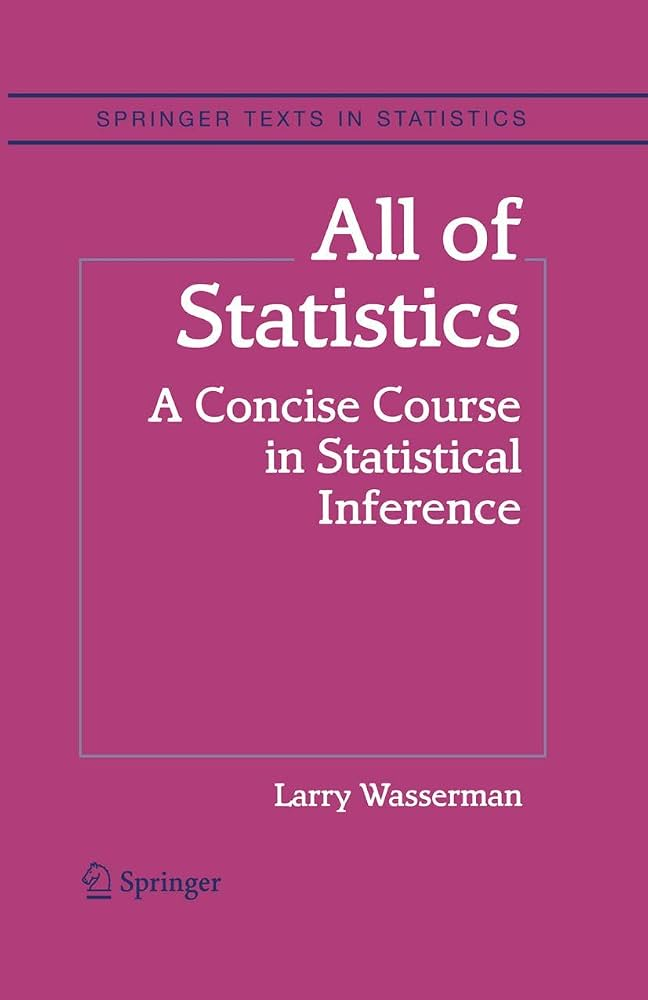

# Wasserman, *All of Statistics: A Concise Course in Statistical Inference* — Topic Checklist

[⬅ Back to tracker](README.md)

## 📑 Table of Contents

**Part I — Probability**

1. [Probability](#ch1)
2. [Random Variables](#ch2)
3. [Expectation](#ch3)
4. [Inequalities](#ch4)
5. [Convergence of Random Variables](#ch5)

**Part II — Statistical Inference**

6. [Models, Statistical Inference and Learning](#ch6)
7. [Estimating the cdf and Statistical Functionals](#ch7)
8. [The Bootstrap](#ch8)
9. [Parametric Inference](#ch9)
10. [Hypothesis Testing and p-values](#ch10)
11. [Bayesian Inference](#ch11)
12. [Statistical Decision Theory](#ch12)

**Part III — Statistical Models and Methods**

13. [Linear and Logistic Regression](#ch13)
14. [Multivariate Models](#ch14)
15. [Inference About Independence](#ch15)
16. [Causal Inference](#ch16)
17. [Directed Graphs and Conditional Independence](#ch17)
18. [Undirected Graphs](#ch18)
19. [Log-Linear Models](#ch19)
20. [Nonparametric Curve Estimation](#ch20)
21. [Smoothing Using Orthogonal Functions](#ch21)
22. [Classification](#ch22)
23. [Probability Redux: Stochastic Processes](#ch23)
24. [Simulation Methods](#ch24)

## Part I — Probability

### Ch. 1 — Probability (p. 3)
- [ ] 1.1 Introduction (p. 3)
- [ ] 1.2 Sample Spaces and Events (p. 3)
- [ ] 1.3 Probability (p. 5)
- [ ] 1.4 Probability on Finite Sample Spaces (p. 7)
- [ ] 1.5 Independent Events (p. 8)
- [ ] 1.6 Conditional Probability (p. 10)
- [ ] 1.7 Bayes' Theorem (p. 12)

[⬆ Back to top](#top)

### Ch. 2 — Random Variables (p. 19)
- [ ] 2.1 Introduction (p. 19)
- [ ] 2.2 Distribution Functions and Probability Functions (p. 20)
- [ ] 2.3 Some Important Discrete Random Variables (p. 25)
- [ ] 2.4 Some Important Continuous Random Variables (p. 27)
- [ ] 2.5 Bivariate Distributions (p. 31)
- [ ] 2.6 Marginal Distributions (p. 33)
- [ ] 2.7 Independent Random Variables (p. 34)
- [ ] 2.8 Conditional Distributions (p. 36)
- [ ] 2.9 Multivariate Distributions and iid Samples (p. 38)
- [ ] 2.10 Two Important Multivariate Distributions (p. 39)
- [ ] 2.11 Transformations of Random Variables (p. 41)
- [ ] 2.12 Transformations of Several Random Variables (p. 42)

[⬆ Back to top](#top)

### Ch. 3 — Expectation (p. 47)
- [ ] 3.1 Expectation of a Random Variable (p. 47)
- [ ] 3.2 Properties of Expectations (p. 50)
- [ ] 3.3 Variance and Covariance (p. 50)
- [ ] 3.4 Expectation and Variance of Important Random Variables (p. 52)
- [ ] 3.5 Conditional Expectation (p. 54)
- [ ] 3.6 Moment Generating Functions (p. 56)

[⬆ Back to top](#top)

### Ch. 4 — Inequalities (p. 63)
- [ ] 4.1 Probability Inequalities (p. 63)
- [ ] 4.2 Inequalities For Expectations (p. 66)

[⬆ Back to top](#top)

### Ch. 5 — Convergence of Random Variables (p. 71)
- [ ] 5.1 Introduction (p. 71)
- [ ] 5.2 Types of Convergence (p. 72)
- [ ] 5.3 The Law of Large Numbers (p. 76)
- [ ] 5.4 The Central Limit Theorem (p. 77)
- [ ] 5.5 The Delta Method (p. 79)
- [ ] 5.7 Appendix (p. 81)
  - [ ] 5.7.1 Almost Sure and L1 Convergence (p. 81)
  - [ ] 5.7.2 Proof of the Central Limit Theorem (p. 81)

[⬆ Back to top](#top)

## Part II — Statistical Inference

### Ch. 6 — Models, Statistical Inference and Learning (p. 87)
- [ ] 6.1 Introduction (p. 87)
- [ ] 6.2 Parametric and Nonparametric Models (p. 87)
- [ ] 6.3 Fundamental Concepts in Inference (p. 90)
  - [ ] 6.3.1 Point Estimation (p. 90)
  - [ ] 6.3.2 Confidence Sets (p. 92)
  - [ ] 6.3.3 Hypothesis Testing (p. 94)

[⬆ Back to top](#top)

### Ch. 7 — Estimating the cdf and Statistical Functionals (p. 97)
- [ ] 7.1 The Empirical Distribution Function (p. 97)
- [ ] 7.2 Statistical Functionals (p. 99)

[⬆ Back to top](#top)

### Ch. 8 — The Bootstrap (p. 107)
- [ ] 8.1 Simulation (p. 108)
- [ ] 8.2 Bootstrap Variance Estimation (p. 108)
- [ ] 8.3 Bootstrap Confidence Intervals (p. 110)
- [ ] 8.5 Appendix (p. 115)
  - [ ] 8.5.1 The Jackknife (p. 115)
  - [ ] 8.5.2 Justification For The Percentile Interval (p. 116)

[⬆ Back to top](#top)

### Ch. 9 — Parametric Inference (p. 119)
- [ ] 9.1 Parameter of Interest (p. 120)
- [ ] 9.2 The Method of Moments (p. 120)
- [ ] 9.3 Maximum Likelihood (p. 122)
- [ ] 9.4 Properties of Maximum Likelihood Estimators (p. 124)
- [ ] 9.5 Consistency of Maximum Likelihood Estimators (p. 126)
- [ ] 9.6 Equivariance of the mle (p. 127)
- [ ] 9.7 Asymptotic Normality (p. 128)
- [ ] 9.8 Optimality (p. 130)
- [ ] 9.9 The Delta Method (p. 131)
- [ ] 9.10 Multiparameter Models (p. 133)
- [ ] 9.11 The Parametric Bootstrap (p. 134)
- [ ] 9.12 Checking Assumptions (p. 135)
- [ ] 9.13 Appendix (p. 135)
  - [ ] 9.13.1 Proofs (p. 135)
  - [ ] 9.13.2 Sufficiency (p. 137)
  - [ ] 9.13.3 Exponential Families (p. 140)
  - [ ] 9.13.4 Computing Maximum Likelihood Estimates (p. 142)

[⬆ Back to top](#top)

### Ch. 10 — Hypothesis Testing and p-values (p. 149)
- [ ] 10.1 The Wald Test (p. 152)
- [ ] 10.2 p-values (p. 156)
- [ ] 10.3 The χ² Distribution (p. 159)
- [ ] 10.4 Pearson's χ² Test For Multinomial Data (p. 160)
- [ ] 10.5 The Permutation Test (p. 161)
- [ ] 10.6 The Likelihood Ratio Test (p. 164)
- [ ] 10.7 Multiple Testing (p. 165)
- [ ] 10.8 Goodness-of-fit Tests (p. 168)
- [ ] 10.10 Appendix (p. 170)
  - [ ] 10.10.1 The Neyman-Pearson Lemma (p. 170)
  - [ ] 10.10.2 The t-test (p. 170)

[⬆ Back to top](#top)

### Ch. 11 — Bayesian Inference (p. 175)
- [ ] 11.1 The Bayesian Philosophy (p. 175)
- [ ] 11.2 The Bayesian Method (p. 176)
- [ ] 11.3 Functions of Parameters (p. 180)
- [ ] 11.4 Simulation (p. 180)
- [ ] 11.5 Large Sample Properties of Bayes' Procedures (p. 181)
- [ ] 11.6 Flat Priors, Improper Priors, and "Noninformative" Priors (p. 181)
- [ ] 11.7 Multiparameter Problems (p. 183)
- [ ] 11.8 Bayesian Testing (p. 184)
- [ ] 11.9 Strengths and Weaknesses of Bayesian Inference (p. 185)

[⬆ Back to top](#top)

### Ch. 12 — Statistical Decision Theory (p. 193)
- [ ] 12.1 Preliminaries (p. 193)
- [ ] 12.2 Comparing Risk Functions (p. 194)
- [ ] 12.3 Bayes Estimators (p. 197)
- [ ] 12.4 Minimax Rules (p. 198)
- [ ] 12.5 Maximum Likelihood, Minimax, and Bayes (p. 201)
- [ ] 12.6 Admissibility (p. 202)
- [ ] 12.7 Stein's Paradox (p. 204)

[⬆ Back to top](#top)

## Part III — Statistical Models and Methods

### Ch. 13 — Linear and Logistic Regression (p. 209)
- [ ] 13.1 Simple Linear Regression (p. 209)
- [ ] 13.2 Least Squares and Maximum Likelihood (p. 212)
- [ ] 13.3 Properties of the Least Squares Estimators (p. 214)
- [ ] 13.4 Prediction (p. 215)
- [ ] 13.5 Multiple Regression (p. 216)
- [ ] 13.6 Model Selection (p. 218)
- [ ] 13.7 Logistic Regression (p. 223)

[⬆ Back to top](#top)

### Ch. 14 — Multivariate Models (p. 231)
- [ ] 14.1 Random Vectors (p. 232)
- [ ] 14.2 Estimating the Correlation (p. 233)
- [ ] 14.3 Multivariate Normal (p. 234)
- [ ] 14.4 Multinomial (p. 235)

[⬆ Back to top](#top)

### Ch. 15 — Inference About Independence (p. 239)
- [ ] 15.1 Two Binary Variables (p. 239)
- [ ] 15.2 Two Discrete Variables (p. 243)
- [ ] 15.3 Two Continuous Variables (p. 244)
- [ ] 15.4 One Continuous Variable and One Discrete (p. 244)

[⬆ Back to top](#top)

### Ch. 16 — Causal Inference (p. 251)
- [ ] 16.1 The Counterfactual Model (p. 251)
- [ ] 16.2 Beyond Binary Treatments (p. 255)
- [ ] 16.3 Observational Studies and Confounding (p. 257)
- [ ] 16.4 Simpson's Paradox (p. 259)

[⬆ Back to top](#top)

### Ch. 17 — Directed Graphs and Conditional Independence (p. 263)
- [ ] 17.1 Introduction (p. 263)
- [ ] 17.2 Conditional Independence (p. 264)
- [ ] 17.3 DAGs (p. 264)
- [ ] 17.4 Probability and DAGs (p. 266)
- [ ] 17.5 More Independence Relations (p. 267)
- [ ] 17.6 Estimation for DAGs (p. 272)

[⬆ Back to top](#top)

### Ch. 18 — Undirected Graphs (p. 281)
- [ ] 18.1 Undirected Graphs (p. 281)
- [ ] 18.2 Probability and Graphs (p. 282)
- [ ] 18.3 Cliques and Potentials (p. 285)
- [ ] 18.4 Fitting Graphs to Data (p. 286)

[⬆ Back to top](#top)

### Ch. 19 — Log-Linear Models (p. 291)
- [ ] 19.1 The Log-Linear Model (p. 291)
- [ ] 19.2 Graphical Log-Linear Models (p. 294)
- [ ] 19.3 Hierarchical Log-Linear Models (p. 296)
- [ ] 19.4 Model Generators (p. 297)
- [ ] 19.5 Fitting Log-Linear Models to Data (p. 298)

[⬆ Back to top](#top)

### Ch. 20 — Nonparametric Curve Estimation (p. 303)
- [ ] 20.1 The Bias-Variance Tradeoff (p. 304)
- [ ] 20.2 Histograms (p. 305)
- [ ] 20.3 Kernel Density Estimation (p. 312)
- [ ] 20.4 Nonparametric Regression (p. 319)

[⬆ Back to top](#top)

### Ch. 21 — Smoothing Using Orthogonal Functions (p. 327)
- [ ] 21.1 Orthogonal Functions and L2 Spaces (p. 327)
- [ ] 21.2 Density Estimation (p. 331)
- [ ] 21.3 Regression (p. 335)
- [ ] 21.4 Wavelets (p. 340)

[⬆ Back to top](#top)

### Ch. 22 — Classification (p. 349)
- [ ] 22.1 Introduction (p. 349)
- [ ] 22.2 Error Rates and the Bayes Classifier (p. 350)
- [ ] 22.3 Gaussian and Linear Classifiers (p. 353)
- [ ] 22.4 Linear Regression and Logistic Regression (p. 356)
- [ ] 22.5 Relationship Between Logistic Regression and LDA (p. 358)
- [ ] 22.6 Density Estimation and Naive Bayes (p. 359)
- [ ] 22.7 Trees (p. 360)
- [ ] 22.8 Assessing Error Rates and Choosing a Good Classifier (p. 362)
- [ ] 22.9 Support Vector Machines (p. 368)
- [ ] 22.10 Kernelization (p. 371)
- [ ] 22.11 Other Classifiers (p. 375)

[⬆ Back to top](#top)

### Ch. 23 — Probability Redux: Stochastic Processes (p. 381)
- [ ] 23.1 Introduction (p. 381)
- [ ] 23.2 Markov Chains (p. 383)
- [ ] 23.3 Poisson Processes (p. 394)

[⬆ Back to top](#top)

### Ch. 24 — Simulation Methods (p. 403)
- [ ] 24.1 Bayesian Inference Revisited (p. 403)
- [ ] 24.2 Basic Monte Carlo Integration (p. 404)
- [ ] 24.3 Importance Sampling (p. 408)
- [ ] 24.4 MCMC Part I: The Metropolis–Hastings Algorithm (p. 411)
- [ ] 24.5 MCMC Part II: Different Flavors (p. 415)

[⬆ Back to top](#top)
