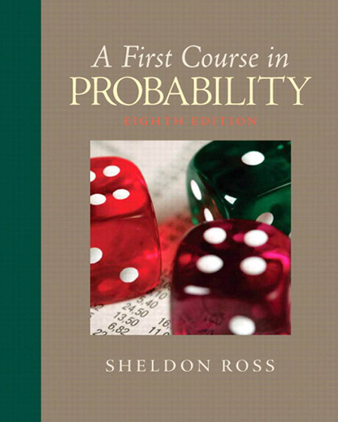

# Wasserman, *All of Statistics: A Concise Course in Statistical Inference*

[⬅ Back to tracker](README.md)

---

# Part I — Probability

## Ch. 1 — Probability
- [ ] 1.1 Introduction
- [ ] 1.2 Sample Spaces and Events
- [ ] 1.3 Probability
- [ ] 1.4 Probability on Finite Sample Spaces
- [ ] 1.5 Independent Events
- [ ] 1.6 Conditional Probability
- [ ] 1.7 Bayes' Theorem
- [ ] Exercises

## Ch. 2 — Random Variables
- [ ] 2.1 Introduction
- [ ] 2.2 Distribution Functions and Probability Functions
- [ ] 2.3 Some Important Discrete Random Variables
- [ ] 2.4 Some Important Continuous Random Variables
- [ ] 2.5 Bivariate Distributions
- [ ] 2.6 Marginal Distributions
- [ ] 2.7 Independent Random Variables
- [ ] 2.8 Conditional Distributions
- [ ] 2.9 Multivariate Distributions and IID Samples
- [ ] 2.10 Two Important Multivariate Distributions
- [ ] 2.11 Transformations of Random Variables
- [ ] 2.12 Transformations of Several Random Variables
- [ ] Exercises

## Ch. 3 — Expectation
- [ ] 3.1 Expectation of a Random Variable
- [ ] 3.2 Properties of Expectations
- [ ] 3.3 Variance and Covariance
- [ ] 3.4 Expectation and Variance of Important Random Variables
- [ ] 3.5 Conditional Expectation
- [ ] 3.6 Moment Generating Functions
- [ ] Exercises

## Ch. 4 — Inequalities
- [ ] 4.1 Probability Inequalities
- [ ] 4.2 Inequalities for Expectations
- [ ] Exercises

## Ch. 5 — Convergence of Random Variables
- [ ] 5.1 Introduction
- [ ] 5.2 Types of Convergence
- [ ] 5.3 The Law of Large Numbers
- [ ] 5.4 The Central Limit Theorem
- [ ] 5.5 The Delta Method
- [ ] Exercises

---

# Part II — Statistical Inference

## Ch. 6 — Models, Statistical Inference and Learning
- [ ] 6.1 Introduction
- [ ] 6.2 Parametric and Nonparametric Models
- [ ] 6.3 Fundamental Concepts in Inference (point estimation, confidence sets, hypothesis testing)
- [ ] Exercises

## Ch. 7 — Estimating the CDF and Statistical Functionals
- [ ] 7.1 The Empirical Distribution Function
- [ ] 7.2 Statistical Functionals
- [ ] Exercises

## Ch. 8 — The Bootstrap
- [ ] 8.1 Simulation
- [ ] 8.2 Bootstrap Variance Estimation
- [ ] 8.3 Bootstrap Confidence Intervals
- [ ] Exercises

## Ch. 9 — Parametric Inference
- [ ] 9.1 Parameter of Interest
- [ ] 9.2 The Method of Moments
- [ ] 9.3 Maximum Likelihood
- [ ] 9.4 Properties of Maximum Likelihood Estimators
- [ ] 9.5 Consistency of Maximum Likelihood Estimators
- [ ] 9.6 Equivariance of the MLE
- [ ] 9.7 Asymptotic Normality
- [ ] 9.8 Optimality
- [ ] 9.9 The Delta Method
- [ ] 9.10 Multiparameter Models
- [ ] 9.11 The Parametric Bootstrap
- [ ] 9.12 Checking Assumptions
- [ ] Exercises

## Ch. 10 — Hypothesis Testing and p-values
- [ ] 10.1 The Wald Test
- [ ] 10.2 p-values
- [ ] 10.3 The χ² Distribution
- [ ] 10.4 Pearson's χ² Test for Multinomial Data
- [ ] 10.5 The Permutation Test
- [ ] 10.6 The Likelihood Ratio Test
- [ ] 10.7 Multiple Testing
- [ ] 10.8 Goodness-of-fit Tests
- [ ] Exercises

## Ch. 11 — Bayesian Inference
- [ ] 11.1 The Bayesian Philosophy
- [ ] 11.2 The Bayesian Method
- [ ] 11.3 Functions of Parameters
- [ ] 11.4 Simulation
- [ ] 11.5 Large Sample Properties of Bayes' Procedures
- [ ] 11.6 Flat Priors, Improper Priors, and "Noninformative" Priors
- [ ] 11.7 Multiparameter Problems
- [ ] 11.8 Bayesian Testing
- [ ] 11.9 Strengths and Weaknesses of Bayesian Inference
- [ ] Exercises

## Ch. 12 — Statistical Decision Theory
- [ ] 12.1 Preliminaries
- [ ] 12.2 Comparing Risk Functions
- [ ] 12.3 Bayes Estimators
- [ ] 12.4 Minimax Rules
- [ ] 12.5 Maximum Likelihood, Minimax, and Bayes
- [ ] 12.6 Admissibility
- [ ] 12.7 Stein's Paradox
- [ ] Exercises

---

# Part III — Statistical Models and Methods

## Ch. 13 — Linear and Logistic Regression
- [ ] 13.1 Simple Linear Regression
- [ ] 13.2 Least Squares and Maximum Likelihood
- [ ] 13.3 Properties of the Least Squares Estimators
- [ ] 13.4 Prediction
- [ ] 13.5 Multiple Regression
- [ ] 13.6 Model Selection
- [ ] 13.7 Logistic Regression
- [ ] Exercises

## Ch. 14 — Multivariate Models
- [ ] 14.1 Random Vectors
- [ ] 14.2 Estimating the Correlation
- [ ] 14.3 Multivariate Normal
- [ ] 14.4 Multinomial
- [ ] Exercises

## Ch. 15 — Inference About Independence
- [ ] 15.1 Two Binary Variables
- [ ] 15.2 Two Discrete Variables
- [ ] 15.3 Two Continuous Variables
- [ ] 15.4 One Continuous Variable and One Discrete
- [ ] Exercises

## Ch. 16 — Causal Inference
- [ ] 16.1 The Counterfactual Model
- [ ] 16.2 Beyond Binary Treatments
- [ ] 16.3 Observational Studies and Confounding
- [ ] 16.4 Simpson's Paradox
- [ ] Exercises

## Ch. 17 — Directed Graphs and Conditional Independence
- [ ] 17.1 Introduction
- [ ] 17.2 Conditional Independence
- [ ] 17.3 DAGs
- [ ] 17.4 Probability and DAGs
- [ ] 17.5 More Independence Relations
- [ ] 17.6 Estimation for DAGs
- [ ] Exercises

## Ch. 18 — Undirected Graphs
- [ ] 18.1 Undirected Graphs
- [ ] 18.2 Probability and Graphs
- [ ] 18.3 Cliques and Potentials
- [ ] 18.4 Fitting Graphs to Data
- [ ] Exercises

## Ch. 19 — Log-Linear Models
- [ ] 19.1 The Log-Linear Model
- [ ] 19.2 Graphical Log-Linear Models
- [ ] 19.3 Hierarchical Log-Linear Models
- [ ] 19.4 Model Generators
- [ ] 19.5 Fitting Log-Linear Models to Data
- [ ] Exercises

## Ch. 20 — Nonparametric Curve Estimation
- [ ] 20.1 The Bias-Variance Tradeoff
- [ ] 20.2 Histograms
- [ ] 20.3 Kernel Density Estimation
- [ ] 20.4 Nonparametric Regression
- [ ] Exercises

## Ch. 21 — Smoothing Using Orthogonal Functions
- [ ] 21.1 Orthogonal Functions and L2 Spaces
- [ ] 21.2 Density Estimation
- [ ] 21.3 Regression
- [ ] 21.4 Wavelets
- [ ] Exercises

## Ch. 22 — Classification
- [ ] 22.1 Introduction
- [ ] 22.2 Error Rates and the Bayes Classifier
- [ ] 22.3 Gaussian and Linear Classifiers
- [ ] 22.4 Linear Regression and Logistic Regression
- [ ] 22.5 Relationship Between Logistic Regression and LDA
- [ ] 22.6 Density Estimation and Naive Bayes
- [ ] 22.7 Trees
- [ ] 22.8 Assessing Error Rates and Choosing a Good Classifier
- [ ] 22.9 Support Vector Machines
- [ ] 22.10 Kernelization
- [ ] 22.11 Other Classifiers
- [ ] Exercises

## Ch. 23 — Probability Redux: Stochastic Processes
- [ ] 23.1 Introduction
- [ ] 23.2 Markov Chains
- [ ] 23.3 Poisson Processes
- [ ] Exercises

## Ch. 24 — Simulation Methods
- [ ] 24.1 Bayesian Inference Revisited
- [ ] 24.2 Basic Monte Carlo Integration
- [ ] 24.3 Importance Sampling
- [ ] 24.4 MCMC Part I: The Metropolis–Hastings Algorithm
- [ ] 24.5 MCMC Part II: Different Flavors
- [ ] Exercises
