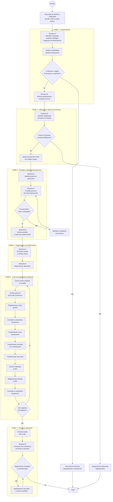

```mermaid
flowchart TD

%% ======================
%% START
%% ======================
START((START))
START --> A0[Necessità di trasferire materialità<br/>da MO a MD su piani diversi]

%% ======================
%% FASE 2 - PIANIFICAZIONE
%% ======================
subgraph F2["FASE 2 – Pianificazione"]
    A1[Struttura A<br/>Identifica materiale,<br/>quantità, tipologia,<br/>magazzino di destinazione]
    A2[Verifica trasferibilità<br/>tramite montacarichi]
    D1{Conforme a regole<br/>di sicurezza e operative?}
    B1[Struttura B<br/>Verifica pianificazione<br/>e autorizza avvio]
end

A0 --> A1 --> A2 --> D1
D1 -- NO --> STOP1[Interruzione processo<br/>Segnalazione a Struttura B] --> END
D1 -- SI --> B1

%% ======================
%% FASE 3 - ABILITAZIONE SICUREZZA
%% ======================
subgraph F3["FASE 3 – Abilitazione sistemi di sicurezza"]
    B2[Struttura B<br/>Richiede abilitazioni<br/>al Posto di Controllo]
    D2{Posto di Controllo<br/>concede abilitazioni?}
    A3[Apertura porte MO e MD<br/>con doppia chiave]
end

B1 --> B2 --> D2
D2 -- NO --> STOP2[Sospensione operazioni<br/>Segnalazione] --> END
D2 -- SI --> A3

%% ======================
%% FASE 4 - PRESIDIO PERCORSI
%% ======================
subgraph F4["FASE 4 – Presidio e preparazione percorsi"]
    A4[Struttura A<br/>Identifica percorsi autorizzati]
    A5[Struttura A<br/>Presidia percorsi<br/>per tutta l'operazione]
    D3{Percorsi liberi,<br/>sicuri e presidiati?}
    B3[Struttura B<br/>Verifica presidio<br/>e autorizza trasferimento]
end

A3 --> A4 --> A5 --> D3
D3 -- NO --> FIX[Ripristino condizioni<br/>di sicurezza] --> A5
D3 -- SI --> B3

%% ======================
%% FASE 5 - PREPARAZIONE
%% ======================
subgraph F5["FASE 5 – Preparazione al trasferimento"]
    A6[Struttura A<br/>Coordina muletti<br/>e verifica mezzi]
    B4[Struttura B<br/>Supervisiona operazioni]
end

B3 --> A6 --> B4

%% ======================
%% FASE 6 - CICLO DI TRASFERIMENTO
%% ======================
subgraph F6["FASE 6 – Ciclo di trasferimento (ripetuto)"]
    C1[Carico di due materiali<br/>su muletto]
    C2[Verifica percorsi<br/>prima del movimento]
    C3[Registrazione uscita<br/>da MO]
    C4[Controllo e controfirma<br/>Struttura B]
    C5[Trasferimento verso<br/>montacarichi]
    C6[Trasferimento verticale<br/>con montacarichi]
    C7[Trasferimento verso MD]
    C8[Scarico materiale<br/>in MD]
    C9[Registrazione entrata<br/>in MD]
    C10[Controllo e controfirma<br/>Struttura B]
    D4{Altri materiali<br/>da trasferire?}
end

B4 --> C1 --> C2 --> C3 --> C4 --> C5 --> C6 --> C7 --> C8 --> C9 --> C10 --> D4
D4 -- SI --> C1

%% ======================
%% FASE 7 - CHIUSURA
%% ======================
subgraph F7["FASE 7 – Chiusura operazioni"]
    Z1[Chiusura porte<br/>MO e MD]
    Z2[Struttura B<br/>Comunica fine operazioni<br/>al Posto di Controllo]
    D5{Registrazioni complete<br/>e controfirmate?}
    Z3[Segnalazione anomalia<br/>e azioni correttive]
end

D4 -- NO --> Z1 --> Z2 --> D5
D5 -- NO --> Z3 --> D5
D5 -- SI --> END

```

%% ======================
%% END
%% ======================
END((END))
